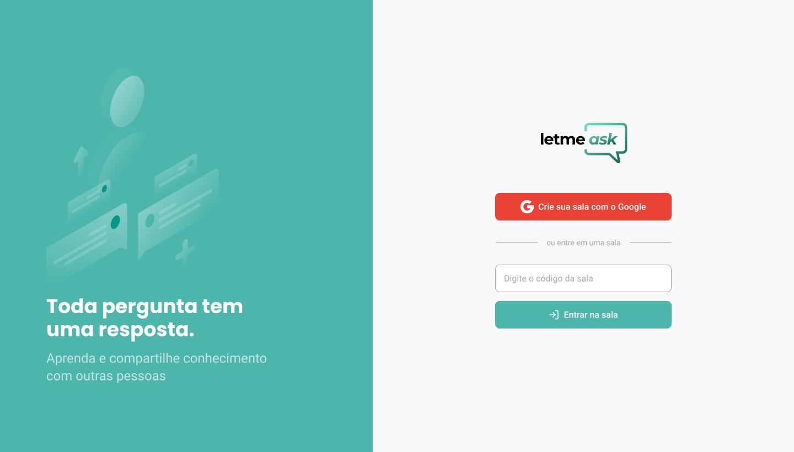

<p align="center">
  
</p>

<h1 align="center" font="100px">
  Crie salas ou entre em uma para mandar perguntas!
<h1>

<p align="center">
    
</p>

<br>

## Technologies 🖥

This project was developed using the following technologies:

- [React](https://reactjs.org)
- [Firebase](https://firebase.google.com/)
- [TypeScript](https://www.typescriptlang.org/)

## New Features 🖱

Last features added in this project:

- Toggle Button for Light and Dark theme


## Getting started 📁

Clone the project and access the folder.

```bash
$ git clone https://github.com/Raquel32132/letmeask.git
$ cd letmeask
```

Follow the steps below:
```bash
# Install the dependencies
$ yarn

# Start the project
$ yarn start
```
<br>
The app will be available for access on your browser at <a href="http://localhost:3000"> http://localhost:3000 </a>
<br>
Or you can also acess the website hosted by Firebase, clicking <a href="https://letmeask-c0795.firebaseapp.com/"> HERE </a>
<br>

## 🔖 Layout

You can view the project layout through the links below:

- [Layout Web](https://www.figma.com/file/u0BQK8rCf2KgzcukdRRCWh/Letmeask/duplicate) 

Remembering that you need to have a [Figma](http://figma.com/) account to access it.

## 📝 License

This project is licensed under the MIT License. See the [LICENSE](LICENSE.md) file for details.


---

<p align="center">Made by Raquel32132 🍰</p>
